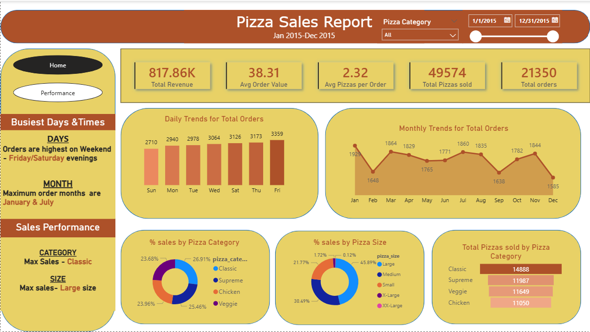
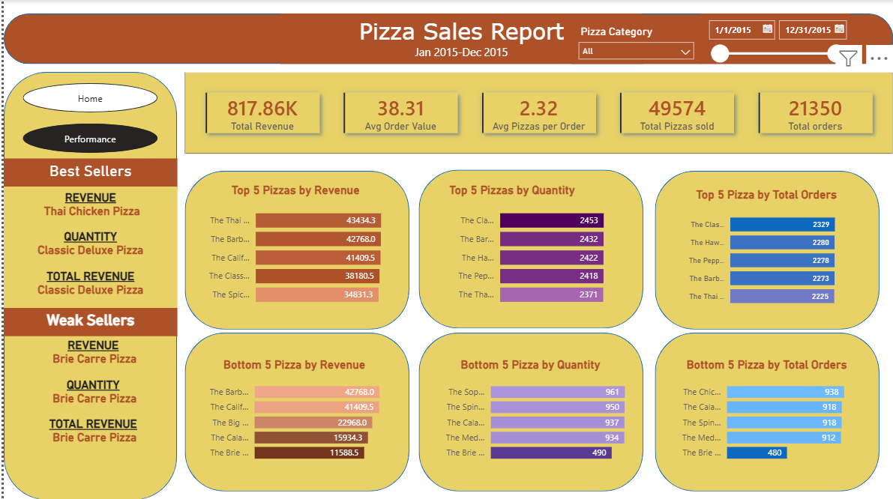

# 🍕 Pizza Sales Analysis Dashboard

## Project Overview
Analyzed pizza sales data obtained from **Kaggle** to uncover trends in customer preferences, popular sizes, and high-revenue products.  
This project demonstrates **SQL data querying** skills for analysis and **Power BI** for interactive dashboard visualization.

## Tools Used
- **SQL**: Data extraction, aggregation, and analysis
- **Power BI**: Interactive dashboards, slicers, and insights
- **Excel / CSV**: Sample dataset

## Key Insights
- **Top-selling Category:** Classic pizzas dominate overall sales.  
- **Most Popular Size:** Large pizzas have the highest sales volume.  
- **Highest Revenue-Generating Pizza:** Brie Carre Pizza contributes the most to revenue and total sales.  
- **High Quantity Sold:** Classic Deluxe Pizza is frequently ordered, even if total revenue is slightly lower.  
- **Additional Revenue Highlights:** Thai Chicken Pizza performs well in revenue, showing strong pricing or popularity despite lower quantities.

**SQL Query**

| # | Description | SQL | Result |
|---|------------|-----|--------|
| 1 | Total Revenue | [Query](SQLQuery/TotalRevenue.sql) | [Result](images/total_revenue.png) |
| 2 | Average Order Value | [Query](SQLQuery/01_total_revenue.sql) | [Result](images/total_revenue.png) |
| 3 | Total Pizzas Sold | [Query](SQLQuery/TotalPizzasSold.sql) | [Result](images/total_revenue.png) |
| 4 | Total Orders | [Query](SQLQuery/TotalOrderValue.sql) | [Result](images/total_revenue.png) |
| 5 | Average Pizzas per Order | [Query](SQLQuery/AveragePizzasperOrder.sql) | [Result](images/total_revenue.png) |
| 6 | Daily Trend for Total Orders | [Query](SQLQuery/DailyTrend.sql) | [Result](images/DailyTrendResult.png) |
| 7 | Monthly Trend for Total Orders | [Query](SQLQuery/MonthlyTrend.sql) | [Result](images/MonthlyTrendResult.png) |
| 8 | Sales by Pizza Category | [Query](SQLQuery/SalesByCtgry.sql) | [Result](images/SalesbyCatgryResult.png) |
| 9 | Sales by Pizza Size | [Query](SQLQuery/SalesbySize.sql) | [Result](images/SalesBySizeResult.png) |
| 10 | Total Pizzas Sold by Category  | [Query](SQLQuery/TotPizzbyCtgry.sql) | [Result](images/TotPizzByCtgry.png) |
| 11 | Top 5 Best Pizzas by Revenue | [Query](SQLQuery/TotalRevenue.sql) | [Result](images/Top5byRevenueResult.png) |
| 12 | Top 5 Best Pizzas by Total Orders | [Query](SQLQuery/Top5pizzbyTotOrder.sql) | [Result](images/Top5byTotOrders.png) |
| 13 | Top 5 Best Pizzas by Quantity | [Query](SQLQuery/Top5PizzbyQty.sql) | [Result](images/Top5byQtyResult.png) |

## Dashboard Preview
Screenshots from the interactive Power BI dashboard:

### Home Page
  
*Displays key performance indicators (KPIs), daily and monthly sales trends, and performance breakdowns by pizza category and size.*

### Performance Page
  
*Highlights top-selling pizzas by revenue, quantity sold, and total orders, providing detailed performance insights.*

## Interactive Dashboard
Download and explore the dashboard in Power BI Desktop:  
[Pizza_Sales_Analysis.pbix](PQ_Pizza_sales.pbix)

## Optional Demo
Watch the interactive walkthrough: [demo.mp4](demo.mp4)
